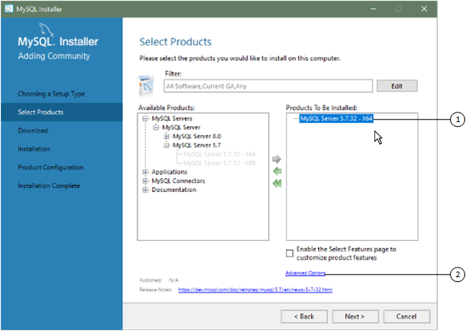

# 2.3.3.2 使用 MySQL 安装程序设置其他服务器路径

从 MySQL 安装程序 1.4.39 开始，如果手动移动已安装服务器的数据目录，MySQL 安装程序将识别更改，并可以处理无错误的重新配置操作。

## 更改 MySQL 服务器的路径

1. 确定要更改并启用 `Advanced Options（高级选项）`链接的 MySQL 服务器，如下所示：

  - 通过执行以下操作之一导航到 `Select Products（选择产品）` 页面：
    - 如果这是 MySQL 安装程序的初始设置，请选择自定义设置类型，然后单击 `Next（下一步）`。
    - 如果你的计算机上安装了 MySQL 安装程序，请单击面板上的 `Add（添加）`。
  - 单击 `Edit（编辑）` 在 `Available Products（可用产品）` 中显示的产品列表上应用过滤器（参阅[查找要安装的产品]()）。
  - 选择服务器实例后，使用箭头将所选服务器移动到 `Products To Be Installed（待安装的产品）` 列表。
  - 单击服务器以选择它。选择服务器时，将在要安装的产品列表下方启用 `Advanced Options（高级选项）` 链接（参见下图）。

2. 单击 `Advanced Options（高级选项）` 打开一个对话框，可以在其中输入替代路径名。验证路径名后，单击 `Next（下一步）` 继续执行配置步骤。

**图 2.9 更改 MySQL 服务器的路径**

> [原文链接](https://dev.mysql.com/doc/refman/8.0/en/mysql-installer-change-path-proc.html)
