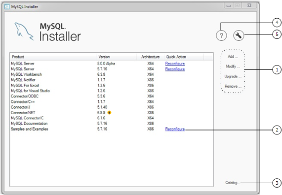
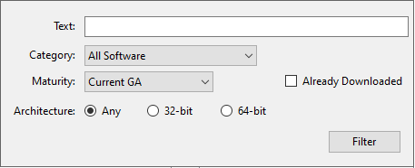

# 2.3.3.4 MySQL 安装程序产品目录和面板

本章节介绍 MySQL 安装程序产品目录、面板以及与产品选择和升级相关的其他操作。

- [产品目录](/2/2.3/2.3.3/2.3.3.4/mysql-installer-catalog-dashboard?id=产品目录)
- [MySQL 安装程序面板](/2/2.3/2.3.3/2.3.3.4/mysql-installer-catalog-dashboard?id=MySQL-安装程序面板)
- [查找待安装产品](/2/2.3/2.3.3/2.3.3.4/mysql-installer-catalog-dashboard?id=查找待安装产品)
- [升级 MySQL 服务器](/2/2.3/2.3.3/2.3.3.4/mysql-installer-catalog-dashboard?id=升级-MySQL-服务器)
- [删除 MySQL 服务器](/2/2.3/2.3.3/2.3.3.4/mysql-installer-catalog-dashboard?id=删除-MySQL-服务器)
- [升级 MySQL 安装程序](/2/2.3/2.3.3/2.3.3.4/mysql-installer-catalog-dashboard?id=升级-MySQL-安装程序)

## 产品目录

产品目录存储了针对 Microsoft Windows 发布的 MySQL 产品的完整列表，可从 [MySQL 下载](https://dev.mysql.com/downloads/)中下载。默认情况下，当存在互联网连接时，MySQL 安装程序会在启动时每七天更新一次目录。还可以从面板（稍后介绍）手动更新目录。

最新目录执行以下操作：

- 选择产品页面的**可用产品（Available Products）**面板。选择以下选项时，将显示此步骤：
  - [初始设置](/2/2.3/2.3.3/2.3.3.1/mysql-installer-setup)期间的`自定义（Custom）`设置类型。
  - 从面板进行**添加（Add）**操作。
- 标识何时可以为面板中列出的已安装产品提供产品更新。

目录包括所有开发版本（预发布）、一般版本（当前 GA）和次要版本（其他版本）。目录中的产品会有所不同，具体取决于您下载的MySQL安装程序版本。

## MySQL 安装程序面板

MySQL 安装程序面板是初始安装完成后启动 MySQL 安装程序时看到的默认视图。如果在安装完成之前关闭了 MySQL 安装程序，MySQL 安装程序会在显示面之前恢复初始安装。

?> Oracle 终身支持所涵盖的产品（如果已安装）可能会出现在面板中。这些产品，如 MySQL for Excel 和 MySQL Notifier，只能修改或删除。

**图 2.11 MySQL 安装程序面板元素**



**MySQL 安装程序面板元素说明**

1. MySQL 安装面板操作提供了多种适用于已安装产品或目录中列出的产品的操作。要启动以下操作，请首先单击操作链接，然后选择要管理的一个或多个产品：

  - **添加（ADD）**：此操作将打开选择产品页面。从那里你可以调整过滤器，选择一个或多个要下载的产品（根据需要），然后开始安装。有关使用过滤器的提示，参阅[查找待安装产品](/2/2.3/2.3.3/2.3.3.4/mysql-installer-catalog-dashboard?id=查找待安装产品)。

  使用方向箭头将每个产品从**可用产品（Available Products）**列移动到**待安装产品（Products To Be Installed）**列。要启用可以自定义功能的产品功能页面，请单击相关复选框（默认情况下禁用）。

  ?> 对于 MySQL 服务器版本 8.0.20（及更早版本）、5.7 和 5.6，你用于运行 MySQL 安装程序的帐户可能没有足够的权限安装**服务器数据文件**，这可能会中断安装，因为无法执行 ExecSecureObjects MSI 操作。要继续，请在再次尝试安装服务器之前取消选择服务器数据文件功能。**服务器数据文件**复选框已从 MySQL Server 8.0.21（或更高版本）的功能树中删除。

  - **修改（Modify）**：使用此操作可以添加或删除与已安装产品关联的功能。你可以修改的功能因产品而异。选中**程序快捷方式（Program Shortcut）**复选框后，产品将出现在 `MySQL` 组下的开始菜单中。

  - **升级（Upgrade）**：此操作将加载选择要升级的产品页面，并在页面中展示所有升级候选项。已安装的产品可以有多个升级版本，并且该操作需要当前的产品目录。MySQL 安装程序一次性升级所有选定的产品。单击 `显示详情（Show Details）`查看 MySQL 安装程序执行的操作。

  - **移除（Remove）**：此操作将打开“删除产品”页面，并用主机上安装的MySQL产品填充该页面。选择要删除（卸载）的MySQL产品，然后单击“执行”开始删除过程。在操作过程中，一个指示器显示执行的步骤数占所有步骤的百分比。

  要选择要删除的产品，请执行以下操作之一：
    - 选中一个或多个产品的复选框。
    - 选中**产品（Product）**复选框以选择所有产品。

2. 每个已安装服务器旁边的快速操作列中的**重新配置（Reconfigure）**链接会加载服务器的当前配置值，然后循环执行所有配置步骤，以便你更改选项和值。必须提供具有 root 权限的凭据才能重新配置这些项目。单击**日志（Log）**选项卡，显示 MySQL 安装程序执行的每个配置步骤的输出。

完成后，MySQL 安装程序会停止服务器，应用配置更改，并为你重新启动服务器。有关每个配置选项的描述，参阅[章节 2.3.3.3.1 “使用 MySQL 安装程序配置 MySQL 服务器”](/2/2.3/2.3.3/2.3.3.3/mysql-installer-workflow?id=2.3.3.3.1-使用-MySQL-安装程序配置-MySQL-服务器)。还可以重新配置与特定 MySQL 服务器版本相关的已安装`示例（Samples and Examples）`，以应用新的功能设置（如果有的话）。

3. **目录（Catalog）**链接允许你手动下载 MySQL 产品的最新目录，然后将这些产品更改与 MySQL 安装程序集成。目录下载操作不会对主机上已安装的产品执行升级。相反，它会返回到面板，并为每个安装了较新版本的产品的版本列添加一个箭头图标。使用升级操作安装较新的产品版本。

你也可以使用**目录（Catalog）**链接显示每个产品的当前更改历史，而无需下载新目录。选中**此次不更新（Do not update at this time）**复选框以仅查看更改历史记录。

4. MySQL 安装程序“关于”图标（）显示了 MySQL 安装程序的当前版本和有关 MySQL 的一般信息。版本号位于**返回（Back）**按钮上方。

?> 报告 MySQL 安装程序问题时，请始终包含此版本号。

除了 MySQL 相关信息（），你还可以从侧面板中选择以下图标：
  - MySQL 安装程序授权图标（）

    本产品可能包括根据许可证使用的第三方软件。如果你使用的是 MySQL 安装程序的商业版本，该图标将打开 MySQL 安装程序商业许可信息用户手册，以获取许可信息，包括与此商业版本中可能包含的第三方软件相关的许可信息。如果你使用的是 MySQL 安装程序的社区版本，该图标将打开 MySQL 安装程序社区许可信息用户手册，以获取许可信息，包括与此社区版本中可能包含的第三方软件相关的许可信息。

  - 资源链接图标（）链接到最新的 MySQL 产品文档、博客、网络研讨会等。

5. MySQL 安装程序选项图标（）包括以下选项卡：

  - **产品目录（Product Catalog）**：管理自动目录更新。默认情况下，MySQL 安装程序在启动时每七天检查一次目录更新。当新产品或产品版本可用时，MySQL安装程序会将其添加到目录中，然后在仪表板中列出的已安装产品的版本号旁边插入一个箭头图标（）。

  使用产品目录选项启用或禁用自动更新，并重置自动目录下载之间的天数。在启动时，MySQL安装程序使用您设置的天数来确定是否应该尝试下载。如果 MySQL 安装程序在下载目录时遇到错误，则会在下次启动时重复此操作。

  - **连接性设置（Connectivity Settings）**：MySQL 安装程序执行的一些操作需要访问互联网。通过此选项，你可以使用默认值来验证连接，或使用其他链接（从列表中选择或手动添加的链接）。选择**手动（Manual）**选项后，可以添加新的链接，并且可以移动或删除列表中的所有链接。选择**自动（Automatic）**选项后，MySQL 安装程序会尝试连接列表中的每个默认链接（按顺序），直到建立连接。如果无法建立连接，则会引发错误。

## 查找待安装产品

目录中的 MySQL 产品按类别列出：MySQL 服务器、应用程序、MySQL 连接器和文档。默认情况下，**可用产品（Available Products）**窗格中仅显示最新的 GA 版本。如果你正在寻找产品的预发行版或旧版本，它可能在默认列表中不可见。

?> 使产品目录保持最新。单击 MySQL 安装程序面板上的**目录（Catalog）**下载最新清单。

要更改默认产品列表，请单击仪表板中的**添加（Add）**以打开选择产品页面，然后单击`编辑（Edit）`以打开如下图所示的对话框。修改设置，然后单击`过滤器（Filter）`。

**图 2.12 过滤可用产品**



重置以下一个或多个字段以修改可用产品列表：

- 文本（Text）：按文本过滤。
- 类别（Category）：所有软件（默认）、MySQL服务器、应用程序、MySQL连接器或文档（用于示例和文档）。
- 成熟度（Maturity）：当前包（最初仅与完整包一起出现）、预发行版、当前GA或其他发行版。如果看到警告，请单击 MySQL 安装程序面板上的**目录（Catalog）**，确认您拥有最新的产品清单。如果 MySQL 安装程序无法下载清单，则你看到的产品范围仅限于捆绑产品、已位于 `Product Cache` 文件夹中的独立产品 MSI，或两者兼而有之。

?> 当您选择发布前的成熟度过滤器时，商业版 MySQL 安装程序不会显示任何MySQL产品。开发中的产品只能从 MySQL 安装程序的社区版本中获得。

- 已下载（Already Downloaded，默认情况下取消选中该复选框）。仅允许您查看和管理下载的产品。
- 体系结构（Architecture）：任意（默认）、32位或64位。

## 升级 MySQL 服务器

重要的服务器升级条件：

- MySQL 安装程序不允许在主要版本或次要版本之间进行服务器升级，但允许在一个发行系列内进行升级，例如从 5.7.18 升级到 5.7.19。
- 不支持里程碑版本之间的升级（或从里程碑版本升级到 GA 版本）。里程碑版本中会发生重大的开发更改，您可能会遇到兼容性问题或启动服务器的问题。
- 对于 MySQL 8.0.16 服务器及更高版本的升级，复选框允许您跳过系统表的升级检查和处理，同时正常检查和处理数据字典表。当跳过上一次服务器升级或将服务器配置为沙盒 InnoDB 群集时，MySQL 安装程序不会提示您复选框。此行为表示 MySQL 服务器执行升级的方式发生了变化（参阅[章节 2.11.3 MySQL 升级过程的升级内容](/2/2.11/2.11.3/upgrading-what-is-upgraded)），并改变了 MySQL 安装程序应用于配置过程的步骤顺序。

如果选择**跳过系统表升级，请检查并处理（Skip system tables upgrade check and process）**。**（不推荐）**。MySQL 安装程序使用[`--upgrade=MINIMAL`](/5/5.1/5.1.7/server-options) 服务器选项启动升级的服务器，该选项仅升级数据字典。如果停止并重新启动服务器而不使用 [`--upgrade=MINIMAL`](/5/5.1/5.1.7/server-options)选项，则服务器会根据需要自动升级系统表。

升级配置（跳过系统表）完成后，日志选项卡和日志文件中将显示以下信息：

```bash
WARNING: The system tables upgrade was skipped after upgrading MySQL Server. The 
server will be started now with the --upgrade=MINIMAL option, but then each 
time the server is started it will attempt to upgrade the system tables, unless 
you modify the Windows service (command line) to add --upgrade=MINIMAL to bypass 
the upgrade.

FOR THE BEST RESULTS: Run mysqld.exe --upgrade=FORCE on the command line to upgrade
the system tables manually.
```

为了选择一个新的服务器版本：

1. 单击**升级（Upgrade）**。确认**可升级产品（Upgradeable Products）**窗格中“产品名称”旁边的复选框中有复选标记。取消选择此时不打算升级的产品。

?> 对于同一版本系列中的服务器里程碑版本，MySQL 安装程序取消选择服务器升级，并显示一条警告，指示不支持升级，确定继续升级的风险，并提供手动执行逻辑升级的步骤摘要。您可以自行承担风险重新选择服务器升级。有关如何使用里程碑版本执行逻辑升级的说明，参阅[逻辑升级](/2/2.11/2.11.6/upgrade-binary-package?id=逻辑升级)。

2. 单击列表中的产品以将其高亮显示。此操作将使用所选产品的每个可用版本的详细信息填充**可升级版本（Upgradeable Versions）**窗格：版本号、发布日期，以及打开该版本发行说明的更改链接。

## 删除 MySQL 服务器

为了删除本地 MySQL 服务器：

1. 确定是否应删除本地数据目录。如果保留数据目录，其他服务器安装可以重用数据。默认情况下启用此选项（删除数据目录）。

2. 单击 `执行（Execute）`开始卸载本地服务器。请注意，您选择删除的所有产品此时也将被卸载。

3. （可选）单击**日志（Log）**选项卡以显示 MySQL 安装程序执行的当前操作。

## 升级 MySQL 安装程序

MySQL 安装程序仍然安装在您的计算机上，和其他软件一样，MySQL 安装程序可以从以前的版本升级。在某些情况下，其他 MySQL 软件可能需要升级 MySQL 安装程序以实现兼容性。本节介绍如何识别 MySQL 安装程序的当前版本，以及如何手动升级 MySQL 安装程序。

**要查找 MySQL 安装程序的安装版本，请执行以下操作：**

1. 从搜索菜单启动 MySQL 安装程序。打开 MySQL 安装程序面板。

2. 单击 MySQL 安装程序的关于图标（）。版本号位于**后退（Back）**按钮上方。

**要启动 MySQL 安装程序的按需升级：**

1. 将安装了 MySQL 安装程序的计算机连接到互联网。

2. 从搜索菜单启动 MySQL 安装程序。打开 MySQL 安装程序面板。

3. 单击面板底部的**目录（Catalog）**以打开更新目录窗口。

4. 单击 `执行（Execute）`开始该过程。如果 MySQL 安装程序的安装版本可以升级，系统将提示您开始升级。

5. 单击`下一步（Next）`查看对目录的所有更改，然后单击`完成（Finish）`返回面板。

6. 验证 MySQL 安装程序的（新）安装版本（参阅前面的过程）。

> [原文链接](https://dev.mysql.com/doc/refman/8.0/en/mysql-installer-catalog-dashboard.html)